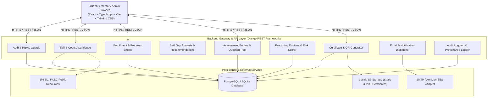

# FX SkillHub — System Architecture & Design Specification

## 1. System Overview & Component Architecture

FX SkillHub is built as a high-performance, modular full-stack application separating a rich client-side presentation layer from a secure, server-authoritative API and domain service layer.



---

## 2. Trust Boundaries & Security Architecture

1. **Client Boundary**:
   - The browser is considered an untrusted execution environment.
   - All state transitions (exam timers, answers, scoring, certificates, eligibility, role assignments) are **server-authoritative**.
   - Client sends telemetry signals (`visibilitychange`, `fullscreenchange`, stream status), which are authenticated and stored with server timestamps.
2. **Authentication & Session Boundary**:
   - Secure HTTP-only cookies or Bearer JWT with server-side validation.
   - Per-request authorization checking role permissions (`IsStudent`, `IsMentor`, `IsAdmin`).
3. **Assessment Isolation**:
   - Questions and options are served without correct answer keys.
   - Answer evaluations and score computations occur exclusively inside the backend evaluation engine.
   - Attempts have strict single-active session constraints.

---

## 3. Data Flow Architecture

### 3.1 Learning Journey
1. Learner logs in → browses courses filtered by verified FXEC department / skill category.
2. Diagnostic Pre-Assessment → answers submitted → topic mastery calculated → personalized module recommendations generated.
3. Learner completes sequential modules → progress tracked per module (`COMPLETED`).
4. Upon meeting eligibility (all required modules completed) → final assessment unlocked.

### 3.2 Secure Assessment Flow
1. Learner enters Preflight → tests camera, screen capture, enters fullscreen.
2. Learner clicks Start Exam → server initializes `AssessmentAttempt` with authoritative `end_time = now + duration`.
3. Client renders randomized question order.
4. Auto-save triggers on each selection (`POST /api/assessments/attempts/:id/answers`).
5. Browser event listeners detect tab switch / fullscreen exit → dispatch `POST /api/assessments/attempts/:id/events` (`severity`, `event_type`).
6. At deadline or explicit submission → backend calculates score → generates `AssessmentResult` → calculates `RiskScore`.

### 3.3 Certification & Verification Flow
1. If score >= pass mark AND review status is `VALID`:
2. Course is marked completed.
3. Backend checks idempotency (verifies certificate does not already exist for this enrollment).
4. Server renders tamper-evident PDF certificate with unique UUID, SHA-256 digest, and QR code pointing to `https://<domain>/verify-certificate/:uuid`.
5. Email notification task is triggered with certificate details and verification URL.
6. Public verification endpoint displays live authentic certificate details.

---

## 4. Technology Stack Justification

| Layer | Selected Technology | Rationale |
|---|---|---|
| **Frontend** | React 18 + TypeScript + Vite | Rapid build speed, type-safe proctoring event handling, seamless component structure, modern responsive UX. |
| **Styling** | Tailwind CSS + Lucide Icons | Clean institutional styling, dark/light contrast, accessible components. |
| **Backend** | Django 5 + Django REST Framework | Mature enterprise framework with built-in ORM, rigorous authentication, admin console, migration tracking, and security defenses. |
| **Database** | PostgreSQL (Prod) / SQLite (Zero-friction local dev/test) | Robust ACID compliance, foreign key integrity, JSON field support for event logs and proctoring telemetry. |
| **Certificate PDF** | ReportLab / WeasyPrint (Python) | High-fidelity server-side PDF generation with dynamic QR embedding and cryptographic hash stamping. |
| **QR Code** | `qrcode` Python library | Standard ISO/IEC 18004 QR generation pointing to canonical verification URL. |
| **Email** | Django Mail Backend (SMTP / SES adapter / File/Console fallback) | Standardized email dispatch with retry tracking and audit logging. |

---

## 5. Deployment Topology

```
+-------------------------------------------------------------+
|                Reverse Proxy (Nginx / Caddy)                 |
|   SSL Termination / Security Headers / Static Asset Cache   |
+------------------------------+------------------------------+
                               |
               +---------------+---------------+
               |                               |
               v                               v
    +--------------------+           +--------------------+
    |   Frontend App     |           |   Backend API      |
    |   Vite SPA Bundle  |           |   Gunicorn/DRF     |
    |   Port 3000 / 80   |           |   Port 8000        |
    +--------------------+           +---------+----------+
                                               |
                               +---------------+---------------+
                               |                               |
                               v                               v
                     +--------------------+          +--------------------+
                     |   PostgreSQL 16    |          |   Local Storage /  |
                     |   Relational DB    |          |   AWS S3 Bucket    |
                     +--------------------+          +--------------------+
```
